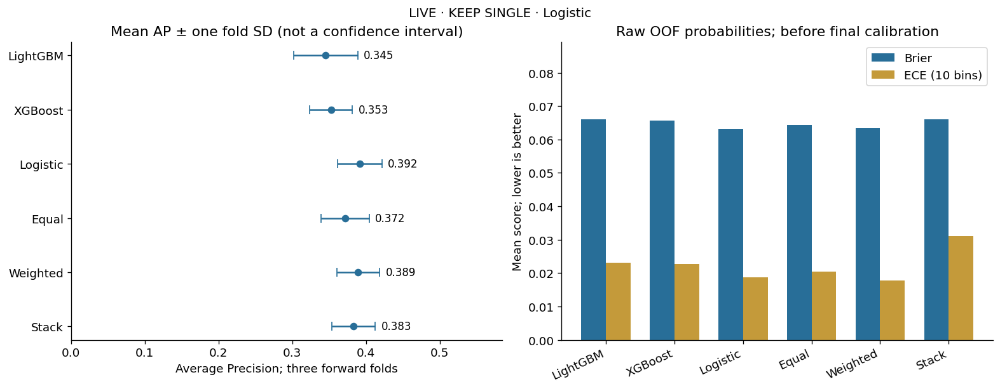
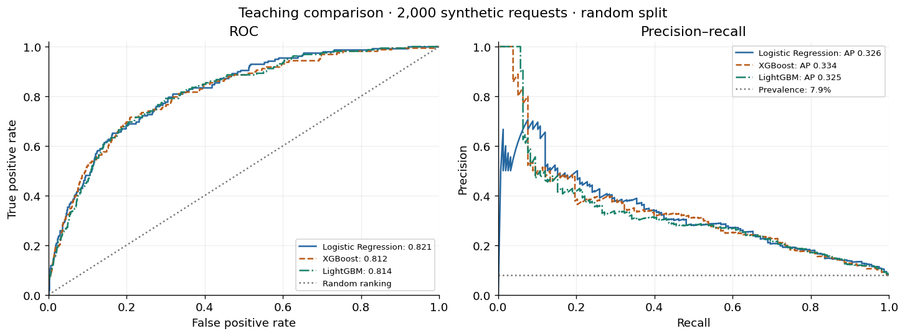
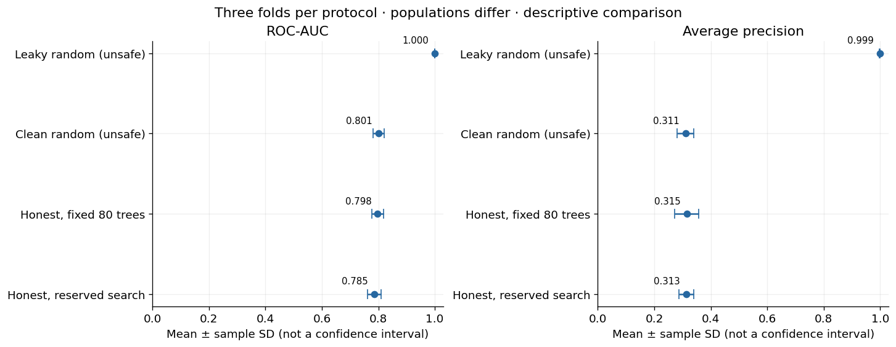
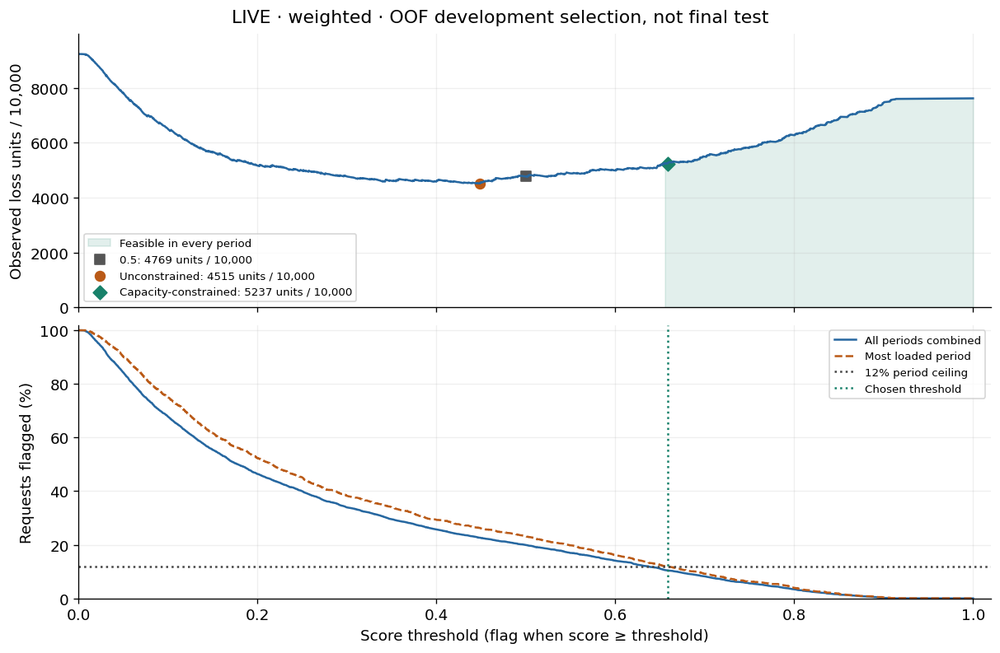
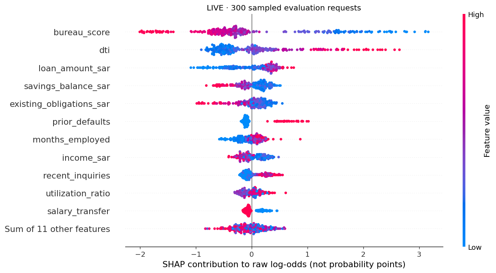
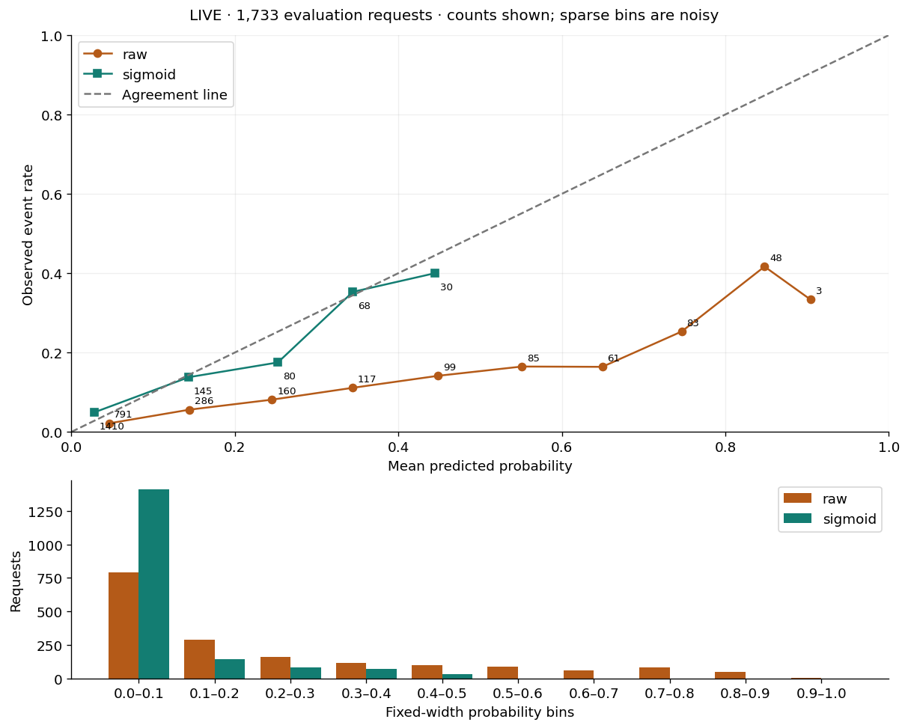
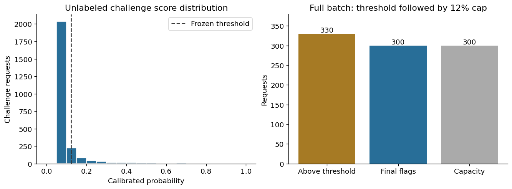

<div align="center">

<h1>Advanced Machine Learning Methods-Tamweel Lite</h1>


<p>


</p>
<strong>Training Program:</strong> SDA-DSC-211 — Advanced Machine Learning Methods
</p>

<a href="https://colab.research.google.com/drive/1Cw8_A6PngwrjMEweEB4MoIC0d07aF6wV?usp=sharing">

</a>

<p>
<a href="https://github.com/nfsh46655-jpg/Shahad-Advanced-Machine-Learning-Methods-Tamweel-Lite-211">GitHub Repository</a>
&nbsp; | &nbsp;
<a href="https://almiyead-rgb.github.io/advanced-machine-learning-methods-sda-dsc-211/#start">Training Program</a>
</p>

</div>

---

## Project Overview

**Tamweel Lite** is an end-to-end machine learning capstone project focused on predicting the risk of financing default within 90 days.

The project simulates a financing organization's need to identify potentially high-risk applications before making a decision. Rather than relying exclusively on a prediction score, it investigates how machine learning models can support reliable, explainable, and operationally feasible decision making.

The complete workflow covers data validation, baseline modeling, gradient boosting, leakage prevention, time-aware validation, hyperparameter optimization, class imbalance, cost-sensitive classification, explainable AI, probability calibration, ensemble learning, and final challenge predictions.

A central principle of this project is that **high predictive performance alone is not sufficient**. A useful model must also be evaluated correctly, produce meaningful risk scores, provide interpretable evidence, and operate within the organization's available review capacity.

### Problem Statement

Financing default prediction presents several challenges:

- **Class imbalance:** Most financing applications do not default, making the positive class relatively rare.
- **Asymmetric error costs:** Missing a future default may be more costly than unnecessarily reviewing a low-risk application.
- **Data leakage:** Information from the future or repeated customers can produce misleading evaluation results.
- **Probability reliability:** Strong ranking performance does not guarantee well-calibrated default probabilities.
- **Operational limitations:** A review team cannot necessarily investigate every application that exceeds a risk threshold.
- **Model complexity:** Advanced models and ensembles do not always outperform simpler approaches.

Tamweel Lite addresses these challenges through five connected practical laboratories.

### Project Goal

Develop a reliable machine learning workflow that estimates financing default risk and converts model scores into a prioritized **human-review queue**.

The system is intended to support review decisions, not automatically approve or reject financing applications.

### Dataset and Prediction Task

| Property | Value |
|---|---|
| Dataset | Synthetic financing applications |
| Total applications | **10,000** |
| Predictor variables | **22** |
| Prediction target | Default within 90 days |
| Positive-class prevalence | **7.89%** |
| Missing data cells identified | **766** |
| Maximum review capacity | **12% per period** |

The dataset contains financial and application-related information used to estimate the likelihood of default.

Examples of investigated variables include credit bureau score, debt-to-income ratio, financing amount, income, savings balance, previous defaults, and recent credit inquiries.

Because only 7.89% of observations belong to the positive class, overall accuracy alone would be an insufficient evaluation metric.

**Average Precision (AP)** is particularly useful for evaluating how effectively the model ranks rare positive cases. **ROC-AUC** provides a complementary assessment of class separation.

However, neither metric directly determines the best operational decision threshold. That requires additional analysis of error costs and review capacity.

### Project Objectives

1. Build reproducible classification models using Logistic Regression, XGBoost, and LightGBM.
2. Investigate data quality, missing values, and target imbalance.
3. Prevent information leakage through time-aware and customer-separated validation.
4. Compare fixed model configurations with Optuna-based hyperparameter optimization.
5. Evaluate class imbalance and asymmetric false-positive and false-negative costs.
6. Select decision thresholds that respect operational review capacity.
7. Explain model predictions using SHAP and permutation importance.
8. Evaluate the reliability of raw and calibrated probabilities.
9. Compare individual models with equal averaging, weighted averaging, and stacking.
10. Select a final model based on forward-validation evidence.
11. Generate challenge predictions under a 12% review-capacity limit.
12. Document the methodology, assumptions, results, and limitations in a reproducible GitHub project.

---

## Executive Results

The final experiment selected **Logistic Regression** after comparing individual models and ensemble approaches under a shared forward-validation framework.

| Measure | Reported Result |
|---|---|
| Final selected model | **Logistic Regression** |
| Mean out-of-fold Average Precision | **0.39166** |
| AP standard deviation across folds | **0.02981** |
| Mean OOF Brier Score | **0.06327** |
| OOF decision threshold | **0.16892** |
| Transported final threshold | **0.1222584314** |
| Challenge applications | **2,500** |
| Applications above threshold | **330** |
| Maximum review capacity | **300 applications (12%)** |
| Final applications selected for review | **300** |

### Why These Results Matter

Logistic Regression achieved the highest mean Average Precision among the evaluated individual and ensemble models.

Although gradient boosting performed competitively in earlier experiments, the final comparison did not provide sufficient evidence that a more complex model would improve generalization.

The final challenge also demonstrated that risk scoring and operational selection are different tasks.

A total of 330 applications exceeded the transported threshold, but only 300 could be selected because of the review-capacity constraint.

The final policy therefore retained the 300 highest-priority applications.

<p align="center">

</p>

---

## Five-Day Project Roadmap

The project follows the five-day learning and implementation structure of the Advanced Machine Learning Methods training program.

Each day focuses on a different stage of the machine learning lifecycle.

| Day | Laboratory | Main Focus | Technical Outcome |
|---|---|---|---|
| **Day 1** | Lab 01 | Baselines and Boosting | Initial model comparison |
| **Day 2** | Lab 02 | Honest Validation and Optuna | Leakage-safe evaluation |
| **Day 3** | Lab 03 | Imbalance and Cost-Sensitive Decisions | Threshold and capacity analysis |
| **Day 4** | Lab 04 | Explainability and Calibration | SHAP and probability diagnostics |
| **Day 5** | Lab 05 | Ensembles and Final Integration | Final model and challenge predictions |

Together, the five labs demonstrate how an initial predictive model can be developed into a more complete decision-support workflow.

---

## Lab 01 — Baseline Models and Gradient Boosting

### Research Question

**Do gradient-boosted tree models outperform a simpler linear baseline when predicting relatively rare financing defaults?**

### Objective

The first laboratory establishes a baseline for the financing default prediction task and compares the predictive performance of different machine learning algorithms.

The goal is to determine whether nonlinear boosting models provide a meaningful advantage over Logistic Regression.

### What I Implemented

I began by checking the Python environment and preparing the required machine learning libraries.

I loaded the synthetic financing dataset and examined its structure, target distribution, missing values, and predictor variables.

After preparing the data for supervised classification, I trained and evaluated three models:

- **Logistic Regression**
- **XGBoost**
- **LightGBM**

I used Logistic Regression as the initial benchmark because it provides a relatively simple, computationally efficient, and interpretable approach to binary classification.

I then evaluated XGBoost and LightGBM to investigate whether gradient-boosted decision trees could capture nonlinear relationships and feature interactions more effectively.

The boosting experiments also used early stopping to control unnecessary model complexity.

### Why These Models Were Selected

**Logistic Regression** provides a useful baseline for estimating binary outcomes and allows more advanced models to be evaluated against a simpler reference.

**XGBoost** combines decision trees through gradient boosting and can capture nonlinear relationships that a linear model may not represent directly.

**LightGBM** offers an efficient gradient-boosting implementation for structured tabular data.

Comparing these models helps determine whether increased complexity produces measurable improvements in the relevant evaluation metrics.

### Evaluation Metrics

Two principal ranking metrics were used:

**ROC-AUC:** Measures the model's ability to distinguish between default and non-default applications across classification thresholds.

**Average Precision:** Evaluates precision across recall levels and is particularly informative when the positive class is relatively rare.

Training time was also recorded to provide a basic comparison of computational efficiency.

### Experimental Results

| Model | ROC-AUC | Average Precision | Training Time |
|---|---:|---:|---:|
| **Logistic Regression** | **0.8213** | 0.3258 | 0.0217 s |
| **XGBoost** | 0.8124 | **0.3338** | 0.2649 s |
| **LightGBM** | 0.8138 | 0.3248 | 0.1653 s |

### Model Performance Visualization

<p align="center">

</p>

### Results and Interpretation

XGBoost achieved the highest preliminary Average Precision of **0.3338**, slightly outperforming Logistic Regression and LightGBM.

However, Logistic Regression achieved the highest ROC-AUC of **0.8213**.

This distinction is important because different evaluation metrics emphasize different aspects of model performance.

A model with stronger overall class separation does not necessarily provide the best precision-recall behavior for a rare positive class.

The relatively small differences in AP also suggest that the preliminary comparison should not be treated as conclusive evidence for selecting a final model.

### Limitations

The initial experiment was exploratory and did not establish a fully customer-disjoint, deployment-style validation protocol.

Consequently, the model rankings from this laboratory were considered preliminary.

A more rigorous evaluation framework was needed before making a final selection.

### Lab 01 Conclusion

The first laboratory established reference performance for three classification algorithms.

XGBoost performed best on preliminary Average Precision, while Logistic Regression remained highly competitive and achieved the strongest ROC-AUC.

**Key lesson:** A more sophisticated algorithm should be selected only when its improvement is supported by reliable evaluation evidence.

---

## Lab 02 — Leakage-Safe Validation and Hyperparameter Optimization

### Research Question

**How much can data leakage inflate predictive performance, and how does chronological, customer-aware validation affect the reliability of model evaluation?**

### Objective

The second laboratory focuses on preventing misleading evaluation results.

Its primary objective is to construct a validation framework that better represents how a financing model would be used to predict future outcomes.

### What I Implemented

I investigated the availability of model features and target outcomes at prediction time.

Because the target represents default within 90 days, the validation design needed to account for the time required for the outcome to become observable.

I implemented forward-in-time evaluation and considered repeated-customer overlap between training and validation data.

The workflow compared intentionally unsafe controls with cleaner validation approaches.

I also used **Optuna** to evaluate whether hyperparameter tuning improved LightGBM performance.

The bounded optimization experiment completed **eight trials**.

### Why Leakage Prevention Matters

Data leakage occurs when information unavailable at the actual prediction time influences model training or evaluation.

For example, a model evaluated using future information may appear exceptionally accurate without possessing equivalent predictive capability in a realistic setting.

Similarly, repeated customers appearing across training and evaluation roles can make performance estimates overly optimistic.

A financing risk model should be evaluated using information that would have been available before the application being predicted.

### Forward-Validation Design

The experiment used three chronological outer-validation periods.

| Fold | Validation Period | Applications |
|---|---|---:|
| 1 | July–December 2023 | 1,632 |
| 2 | January–June 2024 | 1,674 |
| 3 | July–December 2024 | 1,733 |
| **Total** | **Eligible OOF Evaluation** | **5,039** |

The remaining 4,961 observations were not included in this outer out-of-fold evaluation, including warm-up observations and rows excluded under the validation rules.

### Validation Strategies

Four experimental conditions were examined.

**1. Leaky Random Control**

An intentionally invalid experiment used to demonstrate how information leakage can inflate performance.

**2. Clean Random Control**

A random-split comparison without the deliberately leaked signal, but not a suitable final validation design for the intended chronological use case.

**3. Clean Time/Group — Fixed**

A chronological and customer-aware validation experiment using fixed model parameters.

**4. Clean Time/Group — Tuned**

A similar validation experiment incorporating Optuna-based hyperparameter optimization.

### Hyperparameter Optimization

Optuna was used to investigate LightGBM parameter configurations.

The objective was to determine whether tuning could improve model generalization under the appropriate validation constraints.

The tuning experiment was deliberately bounded rather than allowing an unlimited search.

This helped maintain a controlled comparison between fixed and optimized configurations.

### Validation Results

| Validation Experiment | Mean ROC-AUC | Mean AP | AP Standard Deviation |
|---|---:|---:|---:|
| Leaky Random Control — Invalid | 0.9999 | 0.9988 | 0.0014 |
| Clean Random Control | 0.8010 | 0.3110 | 0.0293 |
| **Clean Time/Group — Fixed** | **0.7976** | **0.3153** | 0.0426 |
| Clean Time/Group — Tuned | 0.7855 | 0.3133 | 0.0259 |

### Validation Comparison Visualization

<p align="center">

</p>

### Results and Interpretation

The deliberately leaky control achieved nearly perfect results, including an Average Precision of **0.9988**.

Although such performance might initially appear impressive, it was obtained under an invalid evaluation arrangement.

It therefore cannot be interpreted as evidence of realistic generalization.

Under clean chronological and customer-aware validation, the fixed configuration achieved a mean AP of **0.3153**.

The tuned configuration achieved **0.3133**, slightly below the fixed model.

This result demonstrates that hyperparameter optimization does not automatically improve performance.

It also highlights that validation design can have a much greater influence on apparent model quality than the choice of algorithm or tuning strategy.

### Why the Fixed Model Was Important

The fixed model provided a reliable benchmark under the clean validation design.

Since the tuned model did not improve mean outer-validation AP, there was insufficient evidence to prefer the tuned configuration solely because it had undergone optimization.

### Lab 02 Conclusion

The second laboratory demonstrated the importance of reliable evaluation.

The intentionally leaky experiment produced unrealistic performance, while clean chronological validation provided a more credible assessment.

**Key lesson:** Valid evaluation is more important than achieving artificially high scores, and hyperparameter tuning must be justified by independent validation evidence.

---

## Lab 03 — Cost-Sensitive Learning and Decision Optimization

### Research Question

**How can predicted financing risk be converted into practical review decisions when classification errors have unequal costs and review capacity is limited?**

### Objective

The third laboratory extends predictive modeling into operational decision making.

Instead of evaluating models exclusively through ranking metrics, it examines the consequences of false positives, false negatives, and review workload.

### What I Implemented

I evaluated three strategies for handling class imbalance:

1. Unweighted model training.
2. Class-weighted model training.
3. Oversampling of the minority class.

I then analyzed decision thresholds using out-of-fold predictions.

The experiment introduced simulated error costs and a maximum review-capacity constraint.

This allowed the selected policy to be evaluated not only by predictive performance, but also by its operational feasibility.

### Why Cost-Sensitive Learning Matters

In financing risk assessment, classification errors may have different consequences.

A false negative occurs when a future default is not identified.

A false positive occurs when an application that would not default is flagged for additional review.

Depending on the organization's objectives, these errors may carry different costs.

A threshold that minimizes classification errors may not minimize operational loss.

Likewise, a threshold that minimizes simulated loss may create more review cases than the available team can handle.

### Simulated Decision Costs

| Parameter | Value |
|---|---:|
| False Negative Cost | 10 units |
| False Positive Cost | 1 unit |
| Review Capacity | 12% per period |
| Eligible OOF Applications | 5,039 |

The simulated loss function was:

**Total Loss = (10 × False Negatives) + (1 × False Positives)**

These costs are experimental assumptions rather than measured financial losses.

### Class-Imbalance Experiments

| Training Strategy | Pooled ROC-AUC | Pooled AP |
|---|---:|---:|
| Unweighted | 0.7979 | 0.3091 |
| Weighted | 0.7969 | 0.3100 |
| **Oversampled** | **0.7979** | **0.3159** |

Oversampling achieved the highest pooled Average Precision among the three strategies.

However, the operational decision still required an examination of thresholds, costs, and capacity.

### Threshold Comparison

| Decision Policy | Threshold | Flagged Applications | Simulated Loss |
|---|---:|---:|---:|
| Default Threshold | 0.5000 | 1,005 | 2,403 |
| Minimum Loss Without Capacity Limit | 0.4486 | 1,141 | **2,275** |
| **Minimum Loss With Capacity Limit** | **0.6583** | **526** | **2,639** |

### Cost and Threshold Visualization

<p align="center">

</p>

### Selected Capacity-Constrained Policy

| Metric | Result |
|---|---:|
| Selected Threshold | **0.658347** |
| True Positives | 157 |
| False Positives | 369 |
| False Negatives | 227 |
| True Negatives | 4,286 |
| Recall | 0.4089 |
| Precision | 0.2985 |
| Flagged Applications | 526 |
| Flagged Fraction | 10.44% |
| Simulated Loss | 2,639 units |

### Per-Period Capacity Verification

| Fold | Applications | Review Capacity | Flagged | Status |
|---|---:|---:|---:|---|
| 1 | 1,632 | 195 | 137 | Within Capacity |
| 2 | 1,674 | 200 | 183 | Within Capacity |
| 3 | 1,733 | 207 | 206 | Within Capacity |

### Results and Interpretation

The unconstrained minimum-loss policy achieved a simulated loss of **2,275 units**.

However, it required reviewing 1,141 applications, exceeding the intended review capacity.

The capacity-constrained policy selected a higher threshold of **0.658347**.

This reduced the number of flagged applications to 526 and satisfied the per-period capacity requirements.

The simulated loss increased to **2,639 units**.

This illustrates a practical trade-off between minimizing estimated classification costs and maintaining a feasible review workload.

The mathematically lowest-cost threshold was not necessarily the most appropriate operational choice.

### Additional Analysis

The laboratory also examined sensitivity to alternative false-negative costs and descriptive regional differences in false-positive rates.

These analyses helped investigate the behavior of the decision policy under different assumptions.

However, descriptive subgroup comparisons do not constitute a formal fairness certification.

### Lab 03 Conclusion

The third laboratory demonstrated that classification thresholds should be selected according to operational objectives rather than arbitrary defaults.

**Key lesson:** A useful machine learning decision policy must balance predictive performance, asymmetric error costs, and available review capacity.

---

## Lab 04 — Explainable AI and Probability Calibration

### Research Question

**Can model predictions be interpreted meaningfully, and can the reliability of predicted probabilities be improved without compromising evaluation integrity?**

### Objective

The fourth laboratory investigates model interpretability and probability quality.

It examines which features influence model predictions and whether predicted default probabilities accurately reflect observed outcomes.

### What I Implemented

I developed an explainability and calibration workflow using:

- SHAP explanations.
- Permutation importance.
- Sigmoid probability calibration.
- Brier Score.
- Expected Calibration Error.
- Log Loss.
- Chronological separation of fitting, calibration, policy, and evaluation roles.

The workflow distinguished the data used to fit the model from the data used for calibration, threshold selection, and evaluation.

This separation helps reduce the risk of overly optimistic results caused by reusing evaluation information.

### Data Role Separation

| Data Role | Applications | Purpose |
|---|---:|---|
| Model Fitting | 2,516 | Train the predictive model |
| Calibration | 584 | Fit the calibration mapping |
| Policy Selection | 589 | Select the operational threshold |
| Evaluation | 1,733 | Evaluate the frozen model and policy |

An additional 4,578 rows were excluded through the required gaps and customer-overlap restrictions.

### Why Explainability Matters

Predictive performance alone does not explain why a model assigns a particular risk score.

Explainability techniques help investigate which variables influence predictions and whether the model relies on plausible patterns.

For a financing-related application, this analysis is particularly important because predictions may influence consequential review decisions.

However, explanations describe model behavior and should not be interpreted as proof of causation.

### Permutation Importance

I used held-out permutation importance to measure how much Average Precision decreased when individual feature groups were disrupted.

A larger decrease indicates greater predictive dependence on the feature in the evaluated model.

### Feature Importance Results

| Feature | Mean AP Decrease |
|---|---:|
| **bureau_score** | **0.1270** |
| **dti** | **0.0690** |
| loan_amount_sar | 0.0140 |
| savings_balance_sar | 0.0094 |
| prior_defaults | 0.0065 |
| recent_inquiries | 0.0064 |
| income_sar | 0.0062 |

### Interpretation of Feature Importance

Credit bureau score produced the largest reported reduction in Average Precision when permuted.

Debt-to-income ratio was the second most influential feature under this analysis.

These results indicate that the trained model relied substantially on these financial indicators when ranking default risk.

They do not establish that changing a feature would causally change an applicant's probability of default.

### SHAP Explainability

I applied SHAP to investigate global and local model behavior.

**Global explanations** summarize the relative contribution of features across multiple predictions.

**Local explanations** investigate how features contribute to an individual application's predicted score.

For the weighted tree model, SHAP contributions were interpreted on the log-odds scale rather than as direct probability changes.

### SHAP Visualization

<p align="center">

</p>

### Probability Calibration

A classification model may rank applications correctly while producing unreliable numerical probabilities.

For example, strong Average Precision does not guarantee that applications assigned a probability of 0.30 will default approximately 30% of the time.

Probability calibration addresses this distinction.

I applied sigmoid calibration to the frozen weighted model and compared raw and calibrated predictions on the designated evaluation set.

### Calibration Results

| Metric | Raw Model | Calibrated Model |
|---|---:|---:|
| ROC-AUC | 0.770804 | 0.770804 |
| Average Precision | 0.258677 | 0.258677 |
| Brier Score | 0.113027 | **0.067112** |
| Expected Calibration Error | 0.146871 | **0.022486** |
| Log Loss | 0.357993 | **0.246749** |

### Calibration Visualization

<p align="center">

</p>

### Results and Interpretation

Sigmoid calibration reduced the Brier Score from **0.113027 to 0.067112**.

Expected Calibration Error decreased from **0.146871 to 0.022486**.

Log Loss also improved.

These changes indicate better probability quality on the designated evaluation data.

Meanwhile, ROC-AUC and Average Precision remained unchanged.

This distinction is important because calibration can improve the numerical reliability of probabilities without changing the model's reported ranking performance.

### Operational Capacity Analysis

I also examined whether the calibrated decision policy was compatible with the review-capacity limit.

The notebook reported **CAPACITY_REVIEW_REQUIRED** because some evaluated review scenarios exceeded the available capacity.

Instead of modifying the threshold using the final evaluation outcomes, the workflow retained this warning.

This preserves the separation between policy selection and evaluation.

### Lab 04 Conclusion

The fourth laboratory demonstrated that explainability and calibration provide different but complementary forms of evidence.

SHAP and permutation importance help explain model behavior.

Calibration assesses whether predicted probabilities are reliable.

**Key lesson:** A model can rank applications effectively while still requiring calibration or additional operational policy analysis.

---

## Lab 05 — Ensemble Learning, Final Model Selection, and Challenge Predictions

### Research Question

**Do ensemble methods provide a meaningful improvement over individual models, and which model offers the strongest evidence for final selection under forward validation?**

### Objective

The fifth laboratory integrates the previous experiments into a final model-selection and challenge-scoring workflow.

It compares individual models with ensemble approaches and applies a capacity-aware decision policy to a synthetic challenge dataset.

### What I Implemented

I constructed a final comparison using three forward-validation periods and **2,155 out-of-fold predictions**.

The experiment evaluated six candidate approaches.

### Individual Models

1. Logistic Regression.
2. XGBoost.
3. LightGBM.

### Ensemble Models

1. Equal-weight averaging.
2. Weighted averaging.
3. Stacking.

### Why Evaluate Ensembles?

Ensemble learning combines multiple predictive models with the goal of improving generalization.

Different algorithms may capture different patterns in the data.

For example, Logistic Regression models linear relationships, while gradient-boosted trees can represent nonlinear relationships and interactions.

If the models make complementary errors, combining their predictions may improve performance.

However, ensemble learning introduces additional complexity.

If the ensemble does not outperform a simpler model, the added computational and maintenance requirements may not be justified.

For this reason, the final selection was based on forward-validation evidence rather than model complexity alone.

### Final Model Comparison

| Model | Mean OOF AP | AP Standard Deviation | Mean Brier Score |
|---|---:|---:|---:|
| LightGBM | 0.34549 | 0.04348 | 0.06608 |
| XGBoost | 0.35263 | 0.02904 | 0.06566 |
| **Logistic Regression** | **0.39166** | 0.02981 | **0.06327** |
| Equal Averaging | 0.37170 | 0.03258 | 0.06435 |
| Weighted Averaging | 0.38942 | 0.02906 | 0.06332 |
| Stacking | 0.38314 | 0.02949 | 0.06603 |

### Final Model Selection Visualization

<p align="center">

</p>

### Why Logistic Regression Was Selected

Logistic Regression achieved the highest mean out-of-fold Average Precision of **0.39166**.

Weighted averaging was the closest ensemble competitor, achieving **0.38942**.

However, it did not outperform Logistic Regression.

Equal averaging and stacking also achieved lower mean AP values.

The final results therefore did not justify replacing the simpler model with an ensemble.

The selection was supported by:

- The highest mean AP among the six candidates.
- Competitive fold-to-fold stability.
- The lowest reported mean Brier Score among the compared models.
- Lower implementation complexity.
- A simpler final scoring and maintenance workflow.

### Why Lab 01 and Lab 05 Selected Different Winners

In Lab 01, XGBoost achieved the highest preliminary Average Precision.

In Lab 05, Logistic Regression achieved the highest mean Average Precision.

These findings are not necessarily contradictory.

The experiments used different evaluation designs and model-development procedures.

Lab 01 established exploratory benchmarks.

Lab 05 used a shared forward-validation framework for final model comparison.

Therefore, the numerical scores from the two experiments should not be interpreted as directly comparable improvements.

The final model was selected using the evidence from the final validation framework.

### Out-of-Fold Decision Policy

After selecting Logistic Regression, I evaluated an operational decision threshold using out-of-fold predictions.

The policy needed to satisfy the 12% review-capacity constraint.

| Metric | Result |
|---|---:|
| OOF Decision Threshold | **0.16892** |
| True Positives | 84 |
| False Positives | 161 |
| False Negatives | 95 |
| True Negatives | 1,815 |
| Flagged Applications | 245 / 2,155 |
| Precision | 0.34286 |
| Recall | 0.46927 |
| Maximum Period Flagged Fraction | 11.749% |
| Within Capacity | **Yes** |

The selected OOF threshold satisfied the review-capacity limit across the evaluated periods.

### Final Model Fitting and Threshold Transport

Following model selection, the final scoring workflow used a transported threshold of:

**0.1222584314**

This value differs from the OOF threshold because the final fitted and calibrated scoring workflow uses a different score mapping.

The thresholds should therefore not be treated as interchangeable.

The final calibration diagnostic did not demonstrate improvement on every metric. In that diagnostic, the reported Brier Score changed from 0.076473 to 0.078058.

This reinforces the importance of evaluating calibration rather than assuming that it always improves results.

### Challenge Prediction Workflow

The final model was applied to a synthetic challenge dataset containing **2,500 applications**.

Each application received a predicted risk score.

The decision policy then:

1. Identified applications exceeding the transported threshold.
2. Ranked eligible applications by predicted risk.
3. Applied the 12% review-capacity limit.
4. Selected the highest-priority applications for review.

### Challenge Results

| Challenge Measure | Result |
|---|---:|
| Applications Scored | **2,500** |
| Above-Threshold Applications | **330** |
| Maximum Review Capacity | **300** |
| Final Selected for Review | **300** |
| Above-Threshold Cases Excluded | **30** |
| Transported Threshold | 0.1222584314 |

### Challenge Capacity Visualization

<p align="center">

</p>

### Results and Interpretation

A total of 330 challenge applications exceeded the transported risk threshold.

However, the review team could handle only 300 applications under the defined capacity constraint.

The final policy therefore retained the 300 highest-priority cases and excluded 30 above-threshold applications.

This illustrates that exceeding a risk threshold does not necessarily guarantee selection for review when capacity is limited.

The final workflow combined predictive ranking, probability scoring, threshold selection, and operational prioritization.

### Submission Readiness

The final notebook also reported a submission-readiness status of:

**PROJECT_WORK_REQUIRED**

This indicated that some supporting submission artifacts were not available during that execution.

The status is separate from the completed model-comparison and challenge-scoring results.

It should not be interpreted as evidence that all required submission files have been completed or uploaded.

### Lab 05 Conclusion

The fifth laboratory integrated the machine learning workflow into a final model-selection and decision-support process.

Logistic Regression achieved the strongest reported mean AP under the final evaluation design.

The challenge policy then enforced the operational capacity limit.

**Key lesson:** A defensible final model should be selected using reliable validation evidence, while operational decisions must account for resource constraints.

---

## What the Five Labs Demonstrate

| Question | Evidence-Based Conclusion |
|---|---|
| Does a more complex model always perform better? | **No.** Logistic Regression achieved the highest mean AP in the final comparison. |
| Can leakage distort model evaluation? | **Yes.** The intentionally leaky control produced nearly perfect but invalid results. |
| Does hyperparameter tuning always improve performance? | **No.** The fixed clean time/group model slightly outperformed the tuned configuration. |
| Is the minimum-loss threshold always feasible? | **No.** The unconstrained Lab 03 policy exceeded review capacity. |
| Does calibration always improve ranking? | **No.** Lab 04 improved probability quality while AP remained unchanged. |
| Does a score above the threshold guarantee review? | **No.** Challenge review capacity limited selection to 300 applications. |

The overall project demonstrates that reliable machine learning requires a chain of defensible technical decisions.

Model development, validation, explanation, calibration, and operational policy must be considered together.

---

## Technical Pipeline

The complete workflow consists of the following stages:

1. Validate the synthetic financing dataset.
2. Inspect target prevalence, missing values, and predictor variables.
3. Prepare features for supervised classification.
4. Train Logistic Regression, XGBoost, and LightGBM.
5. Evaluate initial ROC-AUC and Average Precision.
6. Audit feature availability and target maturation.
7. Construct chronological and customer-aware validation folds.
8. Compare fixed and Optuna-tuned configurations.
9. Investigate class-weighting and oversampling strategies.
10. Evaluate asymmetric classification costs.
11. Optimize decision thresholds under review-capacity constraints.
12. Generate SHAP explanations and permutation importance.
13. Evaluate raw and calibrated probabilities.
14. Compare individual and ensemble models.
15. Select the final model using forward-validation evidence.
16. Score the challenge dataset.
17. Enforce the 12% review-capacity limit.
18. Document model behavior, limitations, and supporting evidence.

### Tools and Technologies

| Technology | Application |
|---|---|
| Python | Data processing and machine learning experiments |
| Pandas | Dataset manipulation and analysis |
| NumPy | Numerical computation |
| Scikit-learn | Classification, preprocessing, validation, and metrics |
| XGBoost | Gradient-boosted classification |
| LightGBM | Efficient gradient-boosting experiments |
| Optuna | Hyperparameter optimization |
| SHAP | Global and local model explanations |
| Permutation Importance | Predictive feature-dependence analysis |
| Matplotlib | Model evaluation visualizations |
| Google Colab | Notebook development and execution |
| GitHub | Version control and project documentation |

---

## Repository and Supporting Evidence

The README references visual evidence from the five laboratories.

The expected image directory is:

```text
tamweel_readme_images/
└── assets/
    ├── lab1_model_comparison.png
    ├── lab2_validation_comparison.png
    ├── lab3_cost_threshold.png
    ├── lab4_shap.png
    ├── lab4_calibration.png
    ├── lab5_model_selection.png
    └── lab5_challenge_capacity.png
```

These image paths must match the files committed to GitHub.

The README references the figures; it does not generate them automatically.

---

## Project Deliverables

The official project brief identifies several deliverables intended to support reproducibility, technical evaluation, and professional presentation.

| Deliverable | Purpose |
|---|---|
| **Professional GitHub Repository** | Organize and document the project |
| **Executed Google Colab Notebooks** | Demonstrate the completed experiments |
| **Model and Validation Comparison** | Present predictive performance and evaluation evidence |
| **Decision Card** | Document thresholds, simulated costs, and capacity assumptions |
| **Interpretability Report** | Explain feature importance and model predictions |
| **Ensemble Decision** | Justify the final model-selection decision |
| **Model Card** | Document model purpose, evaluation, and limitations |
| **submission.csv** | Store final challenge predictions |
| **Reproducible Execution Instructions** | Explain how to rerun the experiments |
| **Final Presentation** | Communicate methodology, evidence, and results |

These are requirements from the training brief.

Their inclusion does not imply that every artifact has been completed or committed to the repository.

---

## Reproducing the Project

The experiments were developed using Python and Google Colab.

<a href="https://colab.research.google.com/drive/1Cw8_A6PngwrjMEweEB4MoIC0d07aF6wV?usp=sharing">

</a>

### Execution Steps

1. Open the linked notebook in Google Colab or access the individual lab notebooks in the repository.
2. Configure the required Python dependencies.
3. Verify the dataset paths and environment.
4. Execute the experiments in order from Lab 01 through Lab 05.
5. Preserve chronological validation and customer-separation rules.
6. Review the generated evaluation metrics, figures, and decision-policy outputs.
7. Inspect the final model-selection and challenge-prediction results.

The published values describe the recorded experiments.

Results may differ if dataset contents, library versions, random seeds, or validation rules change.

---

## Interpretation and Limitations

### Synthetic Data

The dataset is synthetic and is intended for educational machine learning experimentation.

The reported results do not establish performance on real-world financing applications.

### Human Oversight

Predicted risk scores are intended to prioritize applications for review.

A flagged application does not represent a confirmed default and should not automatically result in financing rejection.

### Temporal Validity

Using future information or repeated-customer overlap can invalidate apparently strong evaluation results.

### Evaluation Metrics

Average Precision, ROC-AUC, calibration metrics, and simulated operational loss measure different properties.

They should not be interpreted as interchangeable indicators of model quality.

### Explainability

SHAP and permutation importance describe predictive model behavior.

They do not establish causal relationships or guarantee fairness.

### Probability Calibration

Calibration performance depends on the model, evaluation period, and data distribution.

Calibration does not guarantee improvement in every metric.

### Review Capacity

A limited review capacity may prevent some above-threshold applications from being selected.

### Deployment Readiness

The experiments do not establish production readiness, regulatory compliance, or suitability for consequential automated financing decisions.

---

## Future Improvements

Potential future work includes:

- Validating the workflow on representative real-world data with appropriate permissions and governance.
- Evaluating performance drift across additional future periods.
- Monitoring probability calibration under changing default prevalence.
- Conducting more extensive subgroup and fairness analyses.
- Investigating alternative review-capacity limits and error-cost assumptions.
- Developing automated monitoring for ranking quality, calibration, and data drift.
- Improving reproducibility through documented model artifacts and environment configurations.
- Formalizing human-review procedures and model governance.

---

## Training Program and Acknowledgments

This project was developed as part of **SDA-DSC-211 — Advanced Machine Learning Methods**, associated with **SDAIA Academy**.

**Training Organization:** [Saudi Data & Artificial Intelligence Authority (SDAIA)](https://sdaia.gov.sa/)

**Training Program:** [Advanced Machine Learning Methods — SDA-DSC-211](https://almiyead-rgb.github.io/advanced-machine-learning-methods-sda-dsc-211/#start)

**SDAIA Academy Course Materials on GitHub:** [Course Materials](https://github.com/almiyead-rgb)

---

<div align="center">

<p>Advanced Machine Learning Methods | SDAIA Academy</p>

<p>
<a href="https://github.com/nfsh46655-jpg/Shahad-Advanced-Machine-Learning-Methods-Tamweel-Lite-211">View the Project Repository</a>
</p>

</div>
